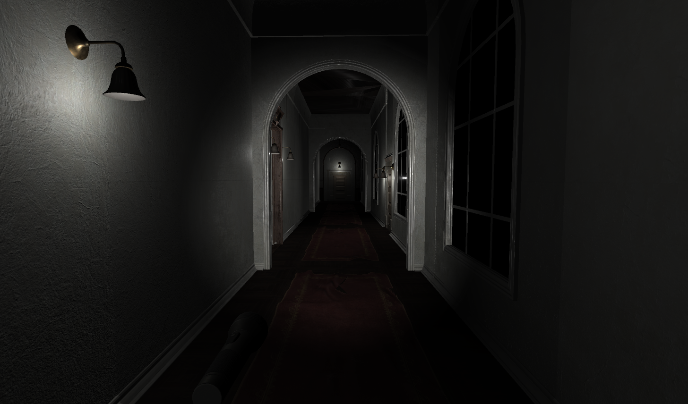

# TheHauntingMansion

TheHauntingMansion is a first person horror game made with Unity3D playable on Linux.

When you first try to clone the repo and unzip the `TheHauntingMansion.zip` file, some error 
can happend due to Large File Storage uses.

Then some steps need to be done before you can play the game :
1. download Git lfs at https://git-lfs.github.com/ and install it on your device
2. clone the repo with Git lfs `git lfs clone`
3. try to unzip `TheHauntingMansion.zip` and if it doesn't work unzip the file at `TheHauntingMansion/.git/lfs/objects/5a/cc`
4. run `TheHauntingMansion.x86_64` and enjoy the game ;)

TheHauntingMansion is a game playable on keyboard and on xbox 360 controller.
For a better experience we recommend playing on controller and with headphones.

Some preview of the game :

